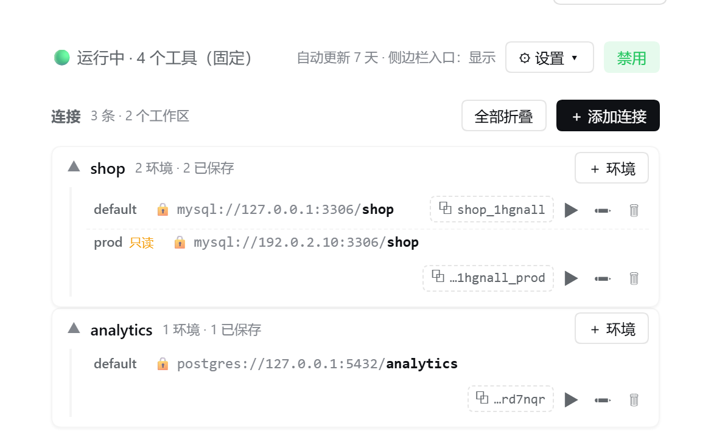
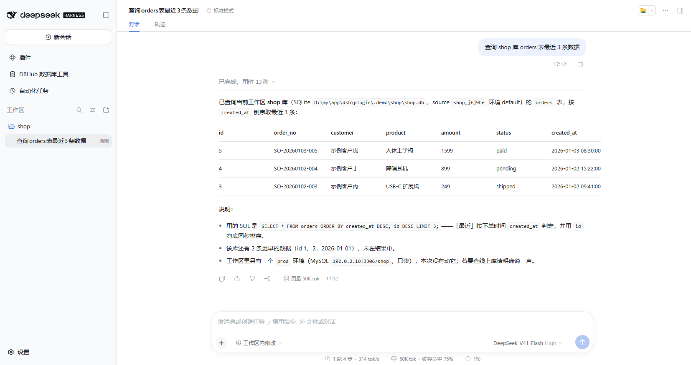
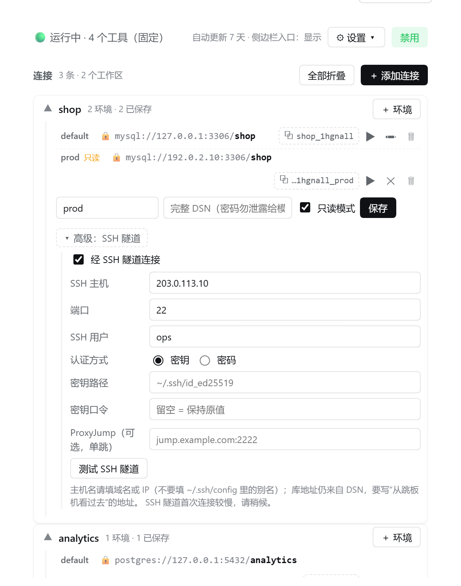

# dsh-dbhub-live

**简体中文** · [English](README.en.md)

[](https://opensource.org/licenses/MIT)
[](#安装)
[](https://github.com/bytebase/dbhub)
[](https://www.npmjs.com/package/dsh-dbhub-live)
[](https://dsh-plugin.org/zh/plugins/mr-mihu/dsh-dbhub-live)

> 让 [DeepSeek Harness](https://github.com/deepseek-ai/DeepSeek-Harness) 里的 AI 直接查你的数据库——**密码永远不会进入模型的上下文**。

装上它，你就能直接对 AI 说「查一下 orders 表最近 10 条」。AI 通过 [DBHub](https://dbhub.ai)（数据库 MCP 服务器）执行 SQL，但它只知道「哪个工作区的哪个环境」，以及 `mysql://host:3306/db` 这类元数据；**密码、账号、完整连接串始终留在你本机**，只在你面前的输入框里敲。

<details>
<summary>📷 界面预览：设置 → DBHub 数据库工具</summary>



</details>

## 为什么用它

| | |
| --- | --- |
| 🔒 **凭据零知识** | 模型只见类型 / 主机 / 端口 / 库名；密码在界面输入，不进模型上下文 |
| ⚡ **一次性进程** | 无常驻 dbhub 服务：每次调用一条独立进程、跑完即杀；一次查询失败只影响它自己，多实例并行不互杀 |
| 🧮 **工具恒定 4 个** | 环境再多也不膨胀模型上下文 |
| 🗂 **按工作区 × 环境管理** | 一个工作区可配 `default` / `prod` / `dev`…（环境名支持中文），用 `source` 区分，绝不串库 |
| 🛡 **环境级只读** | 写操作由 dbhub 原生拒绝；**模型只能开、不能关**（关闭只由你在配置页操作） |
| 🔐 **手动 SSH 隧道** | 跳板机后面的库也能连；SSH 密码 / 密钥口令只在界面输入 |
| 📦 **开箱即用** | 没装 dbhub 就自动安装，之后按间隔自动更新 |

支持 **MySQL · PostgreSQL · MariaDB · SQLite · SQL Server**。

## 安装

```bash
# 已装 dsh
dsh plugin --profile web add dsh-dbhub-live

# 没装 dsh（用 npx）
npx @deepseek-ai/dsh plugin --profile web add dsh-dbhub-live
```

装完**重启 `dsh web`**，打开 **设置 → DBHub 数据库工具** 即可看到配置页（也有左侧栏快捷入口和插件页那行的「配置」，三个入口是同一个页面）。

> 环境要求：`dsh` 0.1.5 起的全部版本线（含 0.2.x）；建议本机有 Node.js ≥ 18（用于自动安装 dbhub）。**只读模式与 SSH 隧道需要 dbhub 1.4.0+**，插件会自动检测并给出升级指引。

## 快速开始

不用记任何命令，直接跟 AI 说：

```text
你：mysql 192.0.2.10:3306 的 app 库，账号 ops
AI：（弹出输入框，你在里面填密码）→ 已保存，source = myapp_1a2b3c_default
你：查询 orders 表最近 3 条数据
AI：…（返回查询结果）
```

<details>
<summary>📷 实际效果：向 AI 提问，直接拿到查询结果</summary>



</details>

密码全程只在你面前的输入框里敲。若你只说了一部分信息（比如「连一下 192.0.2.10 上的 mydb」），插件会**先用这些非敏感信息试连**：能连上就直接保存（不需要密码的库全程零输入），只差密码就只问你「账号（未知时）+ 密码」，信息不全才让你选完整方式（输入 DSN / 填写分项 / 授权扫描项目配置文件）。

工作区里已有 `mise env` 或 `.env`（`DSN` / `DB_*`）时，插件会自动发现，无需手动配置。

## 工具

| 工具 | 说明 |
| --- | --- |
| `dbhub_configure(...)` | 为工作区配置 / 修改连接。**不接受 `dsn` 参数**——密码与连接串一律在界面输入；`type`/`host`/`port`/`database`/`user` 可作为非敏感预填。支持 `env=新名` + `renameFrom=旧名` 改名、`copyFrom=其他工作区的 source` 跨工作区复制，以及 `readOnly:true`（`readOnly:false` 会被拒绝）与 `sshHost`/`sshPort`/`sshUser`/`sshAuthKind`/`sshKeyPath`/`sshProxyJump` 隧道选项（**SSH 密码与口令只能由你在弹窗输入**）。 |
| `dbhub_list_sources()` | 列出全部连接源，**按工作区分组**并标出【当前工作区】；只有元数据与 **source 值**。 |
| `dbhub_execute_sql(source, sql)` | 在指定数据源上执行 SQL；`source` 见 `dbhub_list_sources`。每次调用都是独立的一次性连接，多语句用 `;` 分隔。 |
| `dbhub_search_objects(source, object_type, ...)` | 搜索数据库对象（表 / 视图 / 列 / 索引等）。 |

> **每条 source 只属于一个工作区**：跨工作区复用连接请用 `dbhub_configure` 的 `copyFrom` 复制过来，不要直接拿别的工作区的 source 查询。
> `search_objects` 目前仅对 SQLite 开放；MySQL / PostgreSQL 等请用 `dbhub_execute_sql`（如 `SHOW TABLES`）。

## 配置页

<details>
<summary>📷 连接行编辑器：只读模式与 SSH 隧道</summary>



</details>

- **状态与开关**：运行状态徽章、工具数（恒定 4 个）、环境数、启用 / 禁用开关、最近错误。
- **连接列表**：按工作区组织。所有工作区都只有一个环境时用平铺卡片；任一工作区有多个环境时按工作区分组折叠（点组头展开，默认展开最近使用的那个）。每个连接只占一行：环境名 · 🔒 类型 / 主机 / 端口 / **库名** · `source` 句柄（点它即复制） · ⚡ 测试 / ✏ 修改 / 🗑 删除。窄窗口下先截断主机端口，**库名始终可见**。
- **增删改**：行内 ✏ 改连接串或环境名；「＋ 添加连接」支持中文环境名。**同名环境保存前会先问「是否覆盖」**，取消则一个字都不写。
- **连接测试**：按该环境**真正会被使用的有效连接**（含只读 / 隧道）执行 `SELECT 1`，测试中显示已耗时。结果是一次性反馈，不持久化、不改变连接状态。
- **设置条**（⚙ 设置）：自动更新间隔；「在侧边栏显示入口」开关。

**「在侧边栏显示入口」不是禁用插件**：关掉它只是隐藏左侧栏的快捷入口，插件照常工作、模型照常可以查询；想整体停用才用「禁用」（禁用后入口一律隐藏）。无论哪种状态，**设置页与插件页那行的「配置」始终能进**，随时可以撤销。

## 🔒 只读模式与 SSH 隧道

两项都是**按环境**设置的连接选项，由 dbhub 原生能力执行。开启后，该环境的每次执行改用一份**临时生成的 dbhub 配置**（文件里只有 `${…}` 占位符、不含任何密码，真值只经子进程环境传入），用完即删；其余环境不受影响。

**只读模式**：在连接行 ✏ 勾选「只读模式」保存（模型也能为某环境开启）。开启后 dbhub 只放行只读语句（MySQL 实测为 `select/with/explain/show/describe/desc`），写操作直接返回 `READONLY_VIOLATION`；对象搜索照常可用。**关闭只读只能由你在配置页操作**——模型尝试关闭会被拒绝。只读环境的环境名后会多一个「只读」小标。

**SSH 隧道**（手动配置，适用于库在跳板机后面的场景）：

| 字段 | 说明 |
| --- | --- |
| SSH 主机 | **域名或 IP**（如 `203.0.113.10`）；不要填 `~/.ssh/config` 里的别名 |
| 端口 | 默认 `22` |
| SSH 用户 | 登录跳板机使用的账号 |
| 认证方式 | **密钥**（填密钥路径；私钥有口令可再填口令；**留空 = 用默认 `~/.ssh/id_ed25519`**）或**密码** |
| ProxyJump | 可选，**只支持一跳**，格式 `[user@]host[:port]` |
| 密钥口令 / SSH 密码 | **只能在界面输入**、不回显；编辑时**留空 = 保持原值** |

「高级：SSH 隧道」里有**两个**测试按钮：

- **「测试 SSH 隧道」**只验证隧道这一层：先做 `ssh_host:ssh_port` 的 TCP 可达性探测（约 5 秒，失败会带 `ENOTFOUND` / `ECONNREFUSED` / `ETIMEDOUT` 等错误码），密钥认证时检查私钥文件存在可读，最后**故意**让 dbhub 对一个不可能在监听的地址建隧道，再按证据判定：报错带 **SSH 自身特征**（握手 / 认证 / 私钥）就是隧道断；带 **数据库层特征**（`PROTOCOL_CONNECTION_LOST`、`Connection lost`、`Access denied`、`Unknown database`、`ER_*`、`ECONNREFUSED` 等）就说明连接**已经穿过隧道**，结论是「SSH 隧道可用」；都没有才如实说「无法判定」并附输出末尾。
- **「测试该配置」**按「隧道 + 只读」的**有效连接**实测。

> **一句话记住**：报**数据库层**的错误 = 隧道已经通了，问题在隧道后面的数据库（认证 / 库名 / 目标地址），不必再怀疑 SSH。
>
> **诚实边界**：SSH 层测试证明的是"网络通 + 密钥在 + SSH 层起得来"，不是一次带真实数据库的完整会话验证——隧道建起来不等于后面的库一定连得上，那一步由「测试该配置」回答。

排查顺序：① 本机能 `ssh 用户@跳板机` 登录；② **连接串里的地址必须是"从跳板机看过去"的地址**（库就在跳板机本机时写 `127.0.0.1`）——这是最常见的原因；③ 密钥路径存在且可读（加密私钥记得填口令）；④ ProxyJump 只有一跳。

**前提与限制**：需要 dbhub **1.4.0+**（版本过旧会明确报错，不会静默忽略）；**不支持**多跳、`ProxyCommand`、ssh-agent，也**不复用**任何其他插件（包括 DSH 自带的 SSH 工具）的 SSH 配置——隧道信息只来自你手动填写的内容。只读与 SSH 是两个独立开关，可以只开其中一个。

## 数据位置

所有配置与凭据都在模块目录之外，删掉该目录即完整清空：

```
~/.dsh/storages/dsh-dbhub-live/
```

按 `DSH_HOME` 实例隔离，同一实例的多个 profile 共享（与 dsh 自身 `workspace.json` 同一约定）。连接按「工作区 × 环境」存储；旧格式与手改遗留会在启动时自动清洗并一次性迁移，运行目录被误删或写入被拦截时不会崩溃。**没有常驻进程、没有共享配置文件**，同机多实例并发运行互不干扰。

## 卸载

```bash
dsh plugin --profile web remove dsh-dbhub-live
```

## 故障排查

| 现象 | 处理 |
| --- | --- |
| 首次使用报「无法获取 dbhub」 | 确认本机有 npm 且能联网；离线可手动安装 `dbhub` 并加入 PATH。 |
| 某个环境连接被拒 / 认证失败 | 该环境是独立一次性连接，只影响这一次调用。错误末尾会附指引：让 AI 调用 `dbhub_configure` 引导你在界面更新密码，或直接到配置页修改。 |
| 工具显示「插件已禁用」 | 到 **设置 → DBHub 数据库工具** 点「启用」。 |
| 禁用后左侧栏入口不见了 | 预期行为（禁用中的插件不贡献入口）。点「启用」后入口立即回来。 |
| 开启只读后写操作报 `READONLY_VIOLATION` | 不是故障，是只读在生效。需要写入时在配置页取消该环境的「只读模式」（模型关不掉）。 |
| 只读 / SSH 控件是灰的，或提示 dbhub 版本过旧 | 两项都需要 dbhub 1.4.0+：升级 dbhub，或删除 `~/.dsh/storages/dsh-dbhub-live` 让插件自动装一个满足要求的版本。 |
| 连接测试失败，看不出原因 | 读提示的**末尾**（诊断给的是 dbhub 输出的尾部，会标出【SSH 层】/【数据库层】/【插件层】）。**报【数据库层】就说明隧道已经通了**；有隧道时先点「测试 SSH 隧道」把 SSH 层单独验一遍。 |
| 看不到配置页 | 确认插件已安装并重启过 `dsh web`；配置页只在 Web 设置面板显示，终端环境下不影响工具使用。 |
| 升级 dsh 后提示插件与本版不兼容 | 升级插件到 5.0.0+（同时支持 0.1.x 与 0.2.x）；用 `allow-version` 强行豁免没有意义。 |
| 不希望自动更新 dbhub | 配置页「自动更新间隔(天)」填 `0` 保存，或设环境变量 `DSH_DBHUB_UPDATE_DAYS=0`。 |

**环境变量**（仅这两项，不在 UI 暴露）：`DSH_DBHUB_PACKAGE`（自动安装的包名，默认 `@bytebase/dbhub`）、`DSH_DBHUB_UPDATE_DAYS`（自动更新间隔种子，默认 `7`，被配置页保存的值覆盖）。

## 许可证

[MIT](./LICENSE)
